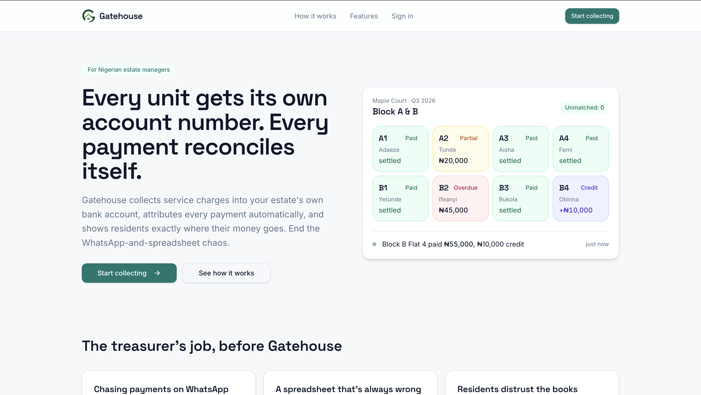

# Nomba Hackathon 2026 — Team Code Dynasty
# Gatehouse

> **Live demo:** [https://gatehouse-two.vercel.app/](https://gatehouse-two.vercel.app/)

---

## What is Gatehouse?

Gatehouse is a payment collection and reconciliation platform built specifically for **Nigerian estate managers and resident associations**.

Today, most estates manage service charges through a painful cycle: WhatsApp payment screenshots, manually updated spreadsheets, arguments about who paid and who didn't, and zero visibility for residents into where their money actually went.

Gatehouse ends that.

Every unit gets its own dedicated 10-digit bank account number. Every transfer made by a resident lands automatically in the right unit's ledger — no payment reference, no note, no phone call required. The books reconcile themselves.

---

## How It Works

**01 — Add your units**
Bulk-upload your block list. Each unit is assigned a dedicated virtual account number, sitting inside the estate's own Nomba bank account.

**02 — Residents pay by bank transfer**
Residents transfer service charges directly to their unit's account number from any bank app. Payments reconcile instantly — no guesswork, no disputes.

**03 — Pay vendors and publish**
Pay security, waste, diesel, and repairs from inside Gatehouse. Publish a plain-language transparency report so residents see exactly where every naira went.

---

## Features

| Feature | Description |
|---|---|
| **Automatic reconciliation** | Per-unit account numbers mean every payment knows exactly where it belongs |
| **Partial & overpayment handling** | Underpaid? It shows. Overpaid? The surplus moves to credit. Always tidy |
| **Arrears tracking** | See who is behind by 30, 60, 90+ days at a glance |
| **Per-unit resident statements** | Every resident gets a no-login link to their own payment history |
| **Vendor payouts** | Pay security, waste, diesel, and repairs from inside the app — every payout is logged |
| **Public transparency report** | A shareable, plain-language view of where the dues went this cycle |
| **Billing cycles** | Create and manage quarterly/annual billing cycles per estate |
| **Exception handling** | Flag and resolve unmatched or disputed payments |

---

## Tech Stack

- **Frontend:** TanStack Start (React), Tailwind CSS, shadcn/ui
- **Backend:** NestJS, Prisma 6, PostgreSQL
- **Payments & Virtual Accounts:** [Nomba API](https://nomba.com) — virtual account creation, webhook ingestion, payouts
- **Realtime:** Server-Sent Events (SSE) for live payment notifications
- **Deployment:** Vercel (frontend)

---

## Nomba Integration

Gatehouse is built on top of the **Nomba API**. Specifically:

- **Virtual accounts** — each estate unit gets a dedicated Nomba virtual account number
- **Webhook ingestion** — every inbound transfer fires a Nomba webhook that Gatehouse processes instantly, matching the payment to the correct unit
- **Payouts** — vendor payments (security, waste, diesel, etc.) are disbursed directly via the Nomba payout API
- **Sub-accounts** — each estate operates its own sub-account so funds never comingle across estates

Money never sits with Gatehouse. It flows directly into the estate's own Nomba account. Gatehouse is the ledger, not the wallet.

---

## Try It Live

**[https://gatehouse-two.vercel.app/](https://gatehouse-two.vercel.app/)**

1. Visit the link above and click **Start collecting**
2. Sign up for a new account
3. Complete onboarding — create your estate and add units
4. Each unit will be assigned a virtual account number
5. Make a test transfer and watch it reconcile in real time on the dashboard

---

## App Pages

| Page | What you'll find |
|---|---|
| `/dashboard` | Overview of the current billing cycle, payment status per unit |
| `/units` | Manage units, residents, and virtual account numbers |
| `/payments` | Full payment ledger — all inbound transactions |
| `/billing` | Billing cycles, charge amounts, due dates |
| `/exceptions` | Unmatched or flagged payments that need review |
| `/reports` | Public and internal transparency reports |
| `/vendors` | Vendor management and payout history |
| `/settings` | Estate settings, account details |

---

## Team

**Team Code Dynasty** — Nomba Hackathon 2026

| Name | Email | GitHub |
|---|---|---|
| Oyedeji Samuel | [oyedejisamuel05@gmail.com](mailto:oyedejisamuel05@gmail.com) | [@Samuel-Oyedeji](https://github.com/Samuel-Oyedeji) |
| Mahmud Adegboyega | [mahmud.adegboyega@gmail.com](mailto:mahmud.adegboyega@gmail.com) | [@MahmudChiv](https://github.com/MahmudChiv) |
| Halimah Oluwafunmilola | [Uracilcycline@gmail.com](mailto:Uracilcycline@gmail.com) | [@Angs0n](https://github.com/Angs0n) |
